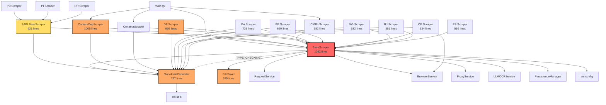

# REFACTORING ANALYSIS REPORT

**Generated**: 31-03-2026 23:08:31
**Target Files**: 13 Python files > 500 lines (9,527 LOC total)
**Analyst**: Copilot Refactoring Specialist
**Report ID**: `refactor_multi_file_31-03-2026_230831`

---

## EXECUTIVE SUMMARY

The brazilian-legislation-scraper codebase contains **13 files exceeding 500 lines** totaling ~10K LOC. The architecture follows a clean inheritance hierarchy (`BaseScraper → StateScraper → concrete scrapers`) with well-separated services. However, three core files — `scraper.py` (1262 lines), `federal_legislation/scrape.py` (1005 lines), and `distrito_federal.py` (995 lines) — are significantly oversized and contain complexity hotspots that hinder maintainability.

**Key findings:**
- **No runtime circular dependencies** — all structural cycles use `TYPE_CHECKING` guards correctly
- `scraper.py` is the God Object bottleneck: 1262 lines, 32 dependents, 59 methods/functions
- 5 functions exceed cyclomatic complexity 20 (CRITICAL risk)
- Test coverage ranges from **45%** (`federal_legislation/scrape.py`) to **93%** (`espirito_santo.py`)
- ~60-70 new tests needed before safe refactoring of high-priority files
- State scrapers contain duplicated patterns that could be extracted into shared mixins

**Recommended approach**: **Multi-phase modular refactoring** starting with the core `scraper.py` decomposition, followed by `converter.py`, then leaf scrapers. Estimated total effort: 8-12 working days.

---

## TABLE OF CONTENTS

1. [Codebase-Wide Context (Phase 0)](#codebase-wide-context)
2. [Current State Analysis (Phase 1)](#current-state-analysis)
3. [Test Coverage Analysis (Phase 2)](#test-coverage-analysis)
4. [Complexity Analysis (Phase 3)](#complexity-analysis)
5. [Refactoring Strategy (Phase 4)](#refactoring-strategy)
6. [Risk Assessment (Phase 5)](#risk-assessment)
7. [Execution Planning (Phase 6)](#execution-planning)
8. [Implementation Checklist](#implementation-checklist)
9. [Success Metrics](#success-metrics)
10. [Appendices](#appendices)

---

## CODEBASE-WIDE CONTEXT

### Related Files Discovery

- **Target file ecosystem**: 13 files > 500 lines across 4 directories
- **`scraper.py` imported by**: 32 files (every scraper + main.py)
- **`converter.py` imported by**: 23 files (18 state scrapers + base modules)
- **Circular dependencies detected**: 2 structural cycles, both safely guarded via `TYPE_CHECKING`
  - `scraper.py ↔ converter.py` (converter's back-ref is TYPE_CHECKING only)
  - `scraper.py ↔ persistence.py` (persistence's back-ref is TYPE_CHECKING only)

### Dependency Matrix

Rows = importer, Columns = imported. `R` = runtime, `T` = TYPE_CHECKING, `L` = lazy runtime.

| Importer ↓ \ Imported → | scraper | converter | sapl | saver | schemas | config | request | browser | ocr | proxy | utils |
|--------------------------|:-------:|:---------:|:----:|:-----:|:-------:|:------:|:-------:|:-------:|:---:|:-----:|:-----:|
| **scraper.py**           | —       | R         |      | R     | R       | R      | R       | R       | T+L | R     |       |
| **converter.py**         | T       | —         |      |       |         |        |         |         |     |       | R     |
| **sapl_scraper.py**      | R       | R         | —    |       | R+T     |        |         |         |     |       |       |
| **saver.py**             |         |           |      | —     | L       | R      |         |         |     |       |       |
| **federal_legislation**  | R       | R         |      |       | T+L     |        |         |         |     |       |       |
| **icmbio**               | R       |           |      |       | R+T     |        |         |         |     |       |       |
| **distrito_federal**     | R       | R         |      |       | T+L     |        |         |         |     |       |       |
| **maranhao**             | R       | R         |      |       | T+L     |        |         |         |     |       |       |
| **pernambuco**           | R       | R         |      |       | T+L     |        | R       |         |     |       |       |
| **ceara**                | R       | R         |      |       | T+L     |        |         | R       |     |       |       |
| **minas_gerais**         | R       | R         |      |       | R+T     |        |         |         |     |       |       |
| **rio_de_janeiro**       | R       | R         |      |       | T       |        |         |         |     |       |       |
| **espirito_santo**       | R       |           |      |       | R       |        |         |         |     |       |       |

### Coupling Metrics

| # | File | Lines | Ca (dependents) | Ce (dependencies) | I = Ce/(Ca+Ce) | Classification |
|---|------|-------|:---:|:---:|:---:|----------------|
| 1 | `scraper.py` | 1262 | 32 | 10 | **0.24** | Stable core (high responsibility) |
| 2 | `converter.py` | 777 | 23 | 2 | **0.08** | Very stable core |
| 3 | `sapl_scraper.py` | 621 | 3 | 3 | **0.50** | Balanced intermediate |
| 4 | `saver.py` | 575 | 1 | 2 | **0.67** | Unstable leaf (functionally stable) |
| 5 | `federal_legislation` | 1005 | 1 | 3 | **0.75** | Unstable leaf |
| 6-13 | State scrapers | 510-995 | 1 | 2-4 | 0.67-0.80 | Unstable leaves |

**Insight**: Architecture follows the **Stable Dependencies Principle** correctly — unstable leaves depend on stable cores, not vice versa.

### Co-Change Clusters

| Cluster | Files | Shared Commits | Implication |
|---------|-------|:--------------:|-------------|
| **Core Infrastructure** | `scraper.py` + `saver.py` + `main.py` | 20+ | Changes to scraper.py cascade to main.py and saver.py |
| **Base Modules** | `scraper.py` + `converter.py` + `sapl_scraper.py` | 30 | Refactors of base code touch all three |
| **State Scraper Cohort** | 15-20 state scrapers simultaneously | per-refactor | Shared patterns cause bulk changes |
| **Non-State Scrapers** | `icmbio` + `federal_legislation` | 16 | Both tightly coupled to scraper.py |

### Additional Refactoring Candidates (outside target list)

| Priority | File | Lines | Reason |
|----------|------|:-----:|--------|
| 🔴 HIGH | `main.py` | 404 | Highest churn (44 commits), configuration hub |
| 🟡 MEDIUM | `conama/scrape.py` | 499 | Near threshold, coupled to base |
| 🟡 MEDIUM | `amapa.py` | 496 | Near threshold, state cohort member |
| 🟢 LOW | `services/request/service.py` | 355 | Isolated service, low co-change |

---

## CURRENT STATE ANALYSIS

### File Metrics Summary

| # | File | Lines | Classes | Methods/Fns | Longest Method | Avg Method Len | Smell Count |
|---|------|:-----:|:-------:|:-----------:|:---------------|:--------------:|:-----------:|
| 1 | `scraper.py` | 1262 | 2 | 59 | `_scrape_year` (~75 ln) | ~21 | 8 |
| 2 | `federal_legislation/scrape.py` | 1005 | 1 | 18 | `_scrape_type` (~141 ln) | ~38 | 5 |
| 3 | `distrito_federal.py` | 995 | 1 | 34 | `_get_doc_data` (~191 ln) | ~26 | 6 |
| 4 | `converter.py` | 777 | 1 | 26 | `clean_norm_soup` (~75 ln) | ~23 | 4 |
| 5 | `maranhao.py` | 733 | 2 | 26 | `_scrape_norms` (~55 ln) | ~23 | 3 |
| 6 | `pernambuco.py` | 650 | 2 | 21 | `_get_doc_data` (~117 ln) | ~26 | 4 |
| 7 | `ceara.py` | 634 | 1 | 18 | `_get_laws_constitution_amendments_doc_data` (~92 ln) | ~31 | 4 |
| 8 | `minas_gerais.py` | 632 | 1 | 21 | `_get_doc_data` (~171 ln) | ~24 | 3 |
| 9 | `sapl_scraper.py` | 621 | 1 | 25 | `_find_content_start` (~83 ln) | ~22 | 4 |
| 10 | `icmbio/scrape.py` | 582 | 1 | 11 | `_parse_dsr_rows` (~88 ln) | ~42 | 3 |
| 11 | `saver.py` | 575 | 2 | 38 | `save_document` (~95 ln) | ~13 | 2 |
| 12 | `rio_de_janeiro.py` | 551 | 1 | 21 | `scrape_constitution` (~56 ln) | ~22 | 3 |
| 13 | `espirito_santo.py` | 510 | 1 | 16 | `_get_doc_data` (~101 ln) | ~26 | 3 |

### Code Smell Inventory

#### Long Methods (>50 lines)

| File | Method | Lines | CC | Risk |
|------|--------|:-----:|:--:|:----:|
| `distrito_federal.py` | `_get_doc_data()` | ~191 | F(45) | 🔴 CRITICAL |
| `federal_legislation/scrape.py` | `_scrape_type()` | ~141 | C(20) | 🔴 CRITICAL |
| `pernambuco.py` | `_get_doc_data()` | ~117 | D(21) | 🔴 HIGH |
| `minas_gerais.py` | `_get_doc_data()` | ~171 | D(25) | 🔴 HIGH |
| `espirito_santo.py` | `_get_doc_data()` | ~101 | C(18) | 🟡 HIGH |
| `ceara.py` | `_get_laws_constitution_amendments_doc_data()` | ~92 | C(16) | 🟡 HIGH |
| `icmbio/scrape.py` | `_parse_dsr_rows()` | ~88 | C(18) | 🟡 HIGH |
| `sapl_scraper.py` | `_find_content_start()` | ~83 | D(26) | 🔴 HIGH |
| `scraper.py` | `_scrape_year()` | ~75 | C(12) | 🟡 MEDIUM |
| `saver.py` | `save_document()` | ~95 | C(11) | 🟡 MEDIUM |
| `converter.py` | `clean_norm_soup()` | ~75 | D(29) | 🔴 HIGH |

#### God Classes (>10 methods)

| File | Class | Method Count | Primary Responsibility | Secondary Responsibilities |
|------|-------|:------------:|----------------------|---------------------------|
| `scraper.py` | `BaseScraper` | 46 | Scrape orchestration | HTTP, PDF, HTML, MHTML, persistence, logging, browser, OCR |
| `saver.py` | `FileSaver` | 33 | File persistence | Sharding, compaction, locking, summary, error logging |
| `distrito_federal.py` | `DFSinjScraper` | 31 | DF legislation scraping | Title parsing, PDF extraction, diary handling |
| `converter.py` | `MarkdownConverter` | 15 | Content→markdown | PDF, HTML, stream, image inlining |

#### Duplicate Code Patterns

| Pattern | Files | Description |
|---------|-------|-------------|
| `_get_doc_data` mega-method | DF, PE, MG, ES, CE | Large if/else chains for document type handling |
| URL format builders | All state scrapers | `_format_search_url()` with query string building |
| Soup cleaning | DF, CE, RJ | `_remove_summary_element()` with similar regex patterns |
| Pagination loops | MA, PE, ES | ASP.NET ViewState/postback pagination |
| Type normalization | MG, DF, SAPL | Norm-type name mapping with fallback logic |

### Responsibility Analysis

| File | Distinct Responsibilities | Should Split? |
|------|:------------------------:|:------------:|
| `scraper.py` | 8+ (HTTP, PDF, HTML, MHTML, persistence, logging, browser, OCR orchestration) | ✅ YES — God Object |
| `converter.py` | 4 (PDF→MD, HTML→MD, soup cleaning, utility functions) | ✅ YES — mixed concerns |
| `saver.py` | 3 (CRUD, sharding/compaction, error logging) | 🟡 MAYBE — cohesive but large |
| `federal_legislation` | 3 (listing parse, export parse, scrape orchestration) | 🟡 MAYBE |
| `sapl_scraper.py` | 3 (content cleaning, PDF handling, API orchestration) | 🟡 MAYBE |
| State scrapers | 1-2 each (scrape + state-specific parsing) | ❌ NO — already focused |

---

## TEST COVERAGE ANALYSIS

### Coverage Summary

| Tier | Files | Coverage | Refactoring Safety |
|------|-------|:-------:|:------------------:|
| 🛑 **Risky** (<70%) | `federal_legislation/scrape.py` (45%), `ceara.py` (64%) | 45-64% | Must add tests first |
| ⚠️ **Moderate** (70-84%) | `scraper.py` (74%), `converter.py` (75%), `sapl_scraper.py` (73%), `distrito_federal.py` (75%), `maranhao.py` (82%), `pernambuco.py` (76%), `rio_de_janeiro.py` (77%) | 73-82% | Add targeted tests for changed areas |
| ✅ **Safe** (≥85%) | `saver.py` (88%), `icmbio/scrape.py` (87%), `minas_gerais.py` (91%), `espirito_santo.py` (93%) | 87-93% | Can refactor with confidence |

### Test-to-Code Ratio

| File | Stmts | Tests/100 Stmts | Asserts/100 Stmts | Coverage% |
|------|:-----:|:---------------:|:-----------------:|:---------:|
| `espirito_santo.py` | 207 | **46.4** | **92.8** | 93% |
| `icmbio/scrape.py` | 214 | 29.4 | 60.3 | 87% |
| `sapl_scraper.py` | 252 | 17.5 | 41.7 | 73% |
| `minas_gerais.py` | 301 | 14.0 | 30.9 | 91% |
| `ceara.py` | 312 | 13.1 | 25.3 | 64% |
| `rio_de_janeiro.py` | 306 | 12.7 | 27.5 | 77% |
| `converter.py` | 374 | 11.2 | 34.2 | 75% |
| `maranhao.py` | 290 | 7.2 | 25.2 | 82% |
| `distrito_federal.py` | 480 | 6.7 | 19.4 | 75% |
| `saver.py` | 342 | 4.1 | 14.6 | 88% |
| `pernambuco.py` | 295 | 4.1 | 14.2 | 76% |
| `federal_legislation` | 322 | 4.0 | 14.9 | **45%** |
| `scraper.py` | 530 | 1.1* | 7.2* | 74% |

*\*`scraper.py` has very few direct tests but many indirect tests through subclass test suites*

### Critical Untested Methods

| File | Method | CC | Lines | Risk |
|------|--------|:--:|:-----:|:----:|
| `federal_legislation` | `_scrape_type()` | 20 | 141 | 🔴 |
| `scraper.py` | `scrape()` | 7 | ~45 | 🔴 |
| `scraper.py` | `_paginate_until_end()` | 11 | ~32 | 🔴 |
| `sapl_scraper.py` | `_scrape_year()` | 11 | ~56 | 🔴 |
| `ceara.py` | `_scrape_type()` (partial) | 6 | ~35 | 🟡 |
| `converter.py` | `download_and_convert()` | 11 | ~40 | 🟡 |
| `pernambuco.py` | `_scrape_type()` | 1 | ~18 | 🟡 |
| `distrito_federal.py` | `_scrape_type()` (partial) | 8 | ~64 | 🟡 |

### Safety Net Requirements

| Priority | Tests Needed | Effort |
|----------|:-----------:|:------:|
| 🔴 High (blocks refactoring) | ~30-35 tests | 2-3 days |
| 🟡 Medium (improves confidence) | ~20-25 tests | 1-2 days |
| 🟢 Low (nice to have) | ~8-10 tests | 0.5 day |
| **Total** | **~60-70 tests** | **~4-6 days** |

---

## COMPLEXITY ANALYSIS

### Cyclomatic Complexity — Critical Hotspots (CC ≥ 15)

| Rank | File | Function/Method | CC | Grade | Lines | Risk |
|:----:|------|-----------------|:--:|:-----:|:-----:|:----:|
| 1 | `distrito_federal.py` | `DFSinjScraper._get_doc_data()` | **45** | F | ~191 | 🔴 CRITICAL |
| 2 | `converter.py` | `clean_norm_soup()` | **29** | D | ~75 | 🔴 CRITICAL |
| 3 | `sapl_scraper.py` | `SAPLBaseScraper._find_content_start()` | **26** | D | ~83 | 🔴 CRITICAL |
| 4 | `minas_gerais.py` | `MGAlmgScraper._get_doc_data()` | **25** | D | ~171 | 🔴 HIGH |
| 5 | `converter.py` | `is_pdf_scanned()` | **23** | D | ~38 | 🟡 HIGH |
| 6 | `federal_legislation` | `CamaraDepScraper._get_document_text_link()` | **21** | D | ~50 | 🟡 HIGH |
| 7 | `pernambuco.py` | `PernambucoAlepeScraper._get_doc_data()` | **21** | D | ~117 | 🟡 HIGH |
| 8 | `federal_legislation` | `CamaraDepScraper._scrape_type()` | **20** | C | ~141 | 🟡 HIGH |
| 9 | `icmbio/scrape.py` | `ICMBioScraper._parse_dsr_rows()` | **18** | C | ~88 | 🟡 MEDIUM |
| 10 | `espirito_santo.py` | `ESAlesScraper._get_doc_data()` | **18** | C | ~101 | 🟡 MEDIUM |
| 11 | `ceara.py` | `CearaAleceScraper._get_laws_constitution_amendments_doc_data()` | **16** | C | ~92 | 🟡 MEDIUM |
| 12 | `distrito_federal.py` | `DFSinjScraper._remove_summary_element()` | **16** | C | ~62 | 🟡 MEDIUM |
| 13 | `minas_gerais.py` | `MGAlmgScraper._get_text_links()` | **16** | C | ~70 | 🟡 MEDIUM |
| 14 | `converter.py` | `MarkdownConverter.bytes_to_markdown()` | **15** | C | ~58 | 🟡 MEDIUM |
| 15 | `pernambuco.py` | `PernambucoAlepeScraper._get_docs_links()` | **15** | C | ~83 | 🟡 MEDIUM |
| 16 | `sapl_scraper.py` | `SAPLBaseScraper._is_footer_block_line()` | **15** | C | ~44 | 🟡 MEDIUM |

### Maintainability Index

| File | MI Score | Grade | Interpretation |
|------|:--------:|:-----:|----------------|
| `scraper.py` | **4.86** | **C** | ⚠️ Low maintainability — dense, complex |
| `distrito_federal.py` | 9.88 | B | Moderate |
| `minas_gerais.py` | 12.34 | B | Moderate |
| `maranhao.py` | 14.42 | B | Moderate |
| `rio_de_janeiro.py` | 14.94 | B | Moderate |
| `pernambuco.py` | 17.41 | B | Moderate |
| `saver.py` | 19.77 | A | Good |
| `converter.py` | 22.18 | A | Good |
| `ceara.py` | 26.56 | A | Good |
| `sapl_scraper.py` | 26.35 | A | Good |
| `federal_legislation` | 29.21 | A | Good |
| `espirito_santo.py` | 38.67 | A | Good |
| `icmbio/scrape.py` | 40.79 | A | Good |

### Halstead Complexity Highlights

| File | Volume | Difficulty | Effort | Est. Bugs |
|------|:------:|:----------:|:------:|:---------:|
| `distrito_federal.py` | 2624 | **10.9** | **28,659** | 0.87 |
| `scraper.py` | 2322 | 7.9 | 18,260 | 0.77 |
| `converter.py` | 2198 | **9.7** | 21,345 | 0.73 |
| `rio_de_janeiro.py` | 1391 | 6.2 | 8,597 | 0.46 |
| `ceara.py` | 1342 | **10.2** | 13,661 | 0.45 |
| `minas_gerais.py` | 1355 | **11.5** | **15,514** | 0.45 |

### Hotspot Priority Matrix

```
High Complexity + High Churn = CRITICAL
High Complexity + Low Churn  = HIGH
Low Complexity  + High Churn = MEDIUM
Low Complexity  + Low Churn  = LOW
```

| File | Max CC | Git Churn | Priority |
|------|:------:|:---------:|:--------:|
| `scraper.py` | 12 | 35 | 🔴 CRITICAL (core + high churn) |
| `converter.py` | 29 | 9 | 🔴 HIGH (extreme CC, moderate churn) |
| `distrito_federal.py` | 45 | 16 | 🔴 HIGH (extreme CC) |
| `federal_legislation` | 21 | 22 | 🔴 HIGH (high CC + churn) |
| `sapl_scraper.py` | 26 | 12 | 🟡 MEDIUM |
| `minas_gerais.py` | 25 | 16 | 🟡 MEDIUM |
| `saver.py` | 11 | 23 | 🟡 MEDIUM (low CC, high churn) |
| `pernambuco.py` | 21 | 14 | 🟡 MEDIUM |
| `ceara.py` | 16 | 18 | 🟡 MEDIUM |
| `icmbio/scrape.py` | 18 | 21 | 🟡 MEDIUM |
| `maranhao.py` | 12 | 15 | 🟢 LOW |
| `rio_de_janeiro.py` | 14 | 17 | 🟢 LOW |
| `espirito_santo.py` | 18 | 17 | 🟢 LOW |

---

## REFACTORING STRATEGY

### Target Architecture

The refactoring aims to decompose the God Object (`BaseScraper`) and reduce complexity hotspots while maintaining backward compatibility. The target architecture introduces focused modules with clear boundaries.

#### Current Architecture
```
BaseScraper (1262 lines, 46 methods)
├── HTTP: make_request, get_soup, fetch_soup_and_mhtml, fetch_soup_with_retry
├── Browser: page, initialize_playwright, get_available_page, release_page, capture_mhtml
├── Content: get_markdown, html_to_markdown, bytes_to_markdown, response_to_markdown, download_and_convert
├── Processing: process_doc, process_pdf_doc, process_html_doc
├── Persistence: save_doc_result, save_doc_error, load_scraped_keys, is_already_scraped
├── Orchestration: scrape, scrape_year, scrape_type, scrape_situation_type
├── Pagination: paginate_until_end, fetch_all_pages
├── Utilities: gather_results, process_documents, with_save, save_gather_errors
├── Lifecycle: __init__, cleanup, before_scrape, initialize_saver
└── Logging/Summary: log_initialization, save_summary, runtime_log_path, ...
```

#### Proposed Architecture
```
BaseScraper (target: ~400 lines, ~15 methods)
├── Orchestration: scrape, scrape_year, scrape_type, scrape_situation_type, before_scrape
├── Lifecycle: __init__, cleanup
├── Delegation: @property converters, @property persistence_mgr
└── Core hooks: _get_docs_links, _get_doc_data (abstract)

MarkdownConverter (already exists — 777 lines → target: ~400 lines)
├── PDF pipeline: bytes_to_markdown, pymupdf4llm_convert, markitdown_convert
├── HTML pipeline: html_to_markdown, convert_html_to_md, convert_html_with_images
└── Utility: is_pdf, is_pdf_scanned, detect_extension, clean_norm_soup, valid_markdown

NEW: ContentProcessor (~200 lines)
├── process_doc, process_pdf_doc, process_html_doc
├── get_markdown, response_to_markdown, download_and_convert
└── clean_norm_soup (delegated from converter)

PersistenceManager (already exists partially — enhance)
├── save_doc_result, save_doc_error
├── load_scraped_keys, is_already_scraped
└── save_summary

NEW: PaginationMixin (~100 lines)
├── paginate_until_end
├── fetch_all_pages
└── gather_results, process_documents, with_save

NEW: BrowserMixin (~80 lines)
├── page, initialize_playwright
├── get_available_page, release_page
├── capture_mhtml, is_mhtml_error_page, fetch_soup_and_mhtml
```

### Extraction Strategy — Priority Order

#### Extraction 1: BrowserMixin from `scraper.py` (LOW risk)

**Source**: `scraper.py` lines 442-576 (~134 lines)
**Target**: `src/scraper/base/browser_mixin.py`
**Pattern**: Extract Mixin
**Affected methods**: `page`, `initialize_playwright`, `_get_available_page`, `_release_page`, `_is_mhtml_error_page`, `_capture_mhtml`, `_fetch_soup_and_mhtml`, `_fetch_soup_with_retry`

**BEFORE** (in scraper.py):
```python
class BaseScraper:
    # ... 46 methods including:
    @property
    def page(self): ...
    async def initialize_playwright(self): ...
    async def _get_available_page(self): ...
    async def _release_page(self, page): ...
    async def _is_mhtml_error_page(self, page): ...
    async def _capture_mhtml(self, url, page): ...
    async def _fetch_soup_and_mhtml(self, url, ...): ...
    async def _fetch_soup_with_retry(self, url, ...): ...
```

**AFTER**:
```python
# src/scraper/base/browser_mixin.py
class BrowserMixin:
    """Playwright browser page pool and MHTML capture."""
    @property
    def page(self): ...
    async def initialize_playwright(self): ...
    async def _get_available_page(self): ...
    async def _release_page(self, page): ...
    async def _is_mhtml_error_page(self, page): ...
    async def _capture_mhtml(self, url, page): ...
    async def _fetch_soup_and_mhtml(self, url, ...): ...
    async def _fetch_soup_with_retry(self, url, ...): ...

# scraper.py
class BaseScraper(BrowserMixin):
    # Browser methods now inherited from mixin
    ...
```

**Tests required**: 3-4 unit tests for mixin isolation
**Risk**: LOW — only 3 scrapers use browser (MA, PR, PE)

---

#### Extraction 2: PaginationMixin from `scraper.py` (LOW risk)

**Source**: `scraper.py` lines 847-961 (~114 lines)
**Target**: `src/scraper/base/pagination_mixin.py` (note: `pagination.py` already exists but is unused at 0% coverage — evaluate merge or replace)
**Pattern**: Extract Mixin
**Affected methods**: `_gather_results`, `_process_documents`, `_with_save`, `_save_gather_errors`, `_fetch_all_pages`, `_paginate_until_end`

**Risk**: LOW-MEDIUM — `_gather_results` and `_process_documents` are used by all scrapers, but the interface is stable.

---

#### Extraction 3: ContentProcessor from `scraper.py` (MEDIUM risk)

**Source**: `scraper.py` lines 597-747 (~150 lines)
**Target**: `src/scraper/base/content_processor.py`
**Pattern**: Extract Class (composed, not inherited)
**Affected methods**: `_clean_norm_soup`, `_html_to_markdown`, `_bytes_to_markdown`, `_get_markdown`, `_response_to_markdown`, `_download_and_convert`, `_process_doc`, `_process_pdf_doc`, `_process_html_doc`

**Risk**: MEDIUM — these methods are heavily used and delegate to `MarkdownConverter`. Must maintain the same interface.

---

#### Extraction 4: Split `converter.py` utilities (MEDIUM risk)

**Source**: `converter.py` lines 66-415 (~350 lines of module-level functions)
**Target**: `src/scraper/base/content_utils.py`
**Pattern**: Extract Module
**Functions to extract**: `is_pdf`, `_expects_pdf`, `_is_image_bytes`, `_pdf_page_count`, `is_pdf_scanned`, `detect_extension`, `wrap_html`, `clean_markdown`, `strip_html_chrome`, `calc_pages`, `clean_norm_soup`, `valid_markdown`, `infer_type_from_title`

This leaves `MarkdownConverter` class (~400 lines) as the sole occupant of `converter.py`.

**Risk**: MEDIUM — 23 files import from `converter.py`. Can maintain backward compatibility via re-exports in `converter.py`:
```python
# converter.py — backward compat
from src.scraper.base.content_utils import is_pdf, clean_norm_soup, ...
```

---

#### Extraction 5: Decompose `DFSinjScraper._get_doc_data()` (HIGH risk)

**Source**: `distrito_federal.py` `_get_doc_data()` — CC=45, ~191 lines
**Target**: Split into 4-5 focused methods within the same file
**Pattern**: Extract Method (multiple)

Proposed decomposition:
```python
async def _get_doc_data(self, doc_info, ...):
    """Orchestrator — delegates to type-specific handlers."""
    raw_data = await self._fetch_raw_doc_data(doc_info)
    if raw_data.is_pdf:
        return await self._process_df_pdf_doc(raw_data)
    return await self._process_df_html_doc(raw_data)

async def _fetch_raw_doc_data(self, doc_info): ...  # ~40 lines
async def _process_df_pdf_doc(self, raw_data): ...  # ~50 lines
async def _process_df_html_doc(self, raw_data): ... # ~60 lines
async def _resolve_df_fallbacks(self, ...): ...      # ~40 lines
```

**Risk**: HIGH — CC=45, 75% coverage, complex branching. Requires additional tests first.

---

#### Extraction 6: Decompose `clean_norm_soup()` in `converter.py` (MEDIUM risk)

**Source**: `converter.py` `clean_norm_soup()` — CC=29, ~75 lines
**Target**: Break into focused cleaning passes within the same file
**Pattern**: Extract Method (chain of responsibility)

```python
def clean_norm_soup(soup, ...):
    """Orchestrator for soup cleaning."""
    _remove_unwanted_tags(soup, remove_images)
    _clean_attributes(soup)
    _normalize_whitespace(soup)
    _strip_boilerplate(soup)
    return soup
```

**Risk**: MEDIUM — 23 dependents, but function is self-contained. Test first.

---

#### Extraction 7: Decompose `_find_content_start()` in `sapl_scraper.py` (MEDIUM risk)

**Source**: `sapl_scraper.py` `_find_content_start()` — CC=26, ~83 lines
**Target**: Break into scoring-based selection within the same file
**Pattern**: Extract Method

**Risk**: MEDIUM — 3 SAPL-based scrapers depend on this logic. Good test coverage exists.

---

### Shared Pattern Extraction (Cross-Scraper)

State scrapers share several duplicated patterns that could be extracted:

| Pattern | Instances | Proposed Target |
|---------|:---------:|-----------------|
| ASP.NET ViewState/postback handling | MA, PE, ES | `src/scraper/base/aspnet_mixin.py` |
| Summary element removal | DF, CE, RJ | Method in `BaseScraper` or utility |
| Type normalization with fallback | MG, DF, SAPL | Method in `StateScraper` |
| Diary/PDF page extraction | DF | Keep in DF (too specialized) |

---

## RISK ASSESSMENT

### Risk Matrix

| Risk | Likelihood | Impact | Score | Mitigation |
|------|:----------:|:------:|:-----:|------------|
| Breaking `BaseScraper` API | Medium | **High** | **6** | Extract to mixins (preserves MRO), maintain facade re-exports |
| Breaking `converter.py` imports | Medium | **High** | **6** | Re-export from `converter.py` for backward compat |
| `_get_doc_data` decomposition introduces bugs | **High** | Medium | **6** | Write 5-10 new tests first, golden-output comparison |
| Performance regression from additional method calls | Low | Low | **1** | Negligible — Python method dispatch is ~100ns |
| Circular imports from new modules | Medium | Medium | **4** | Follow existing TYPE_CHECKING pattern, test imports |
| Merge conflicts with concurrent development | Medium | Medium | **4** | Feature branch, incremental PRs per extraction |
| `pagination.py` (0% coverage, unused) conflicts | Low | Low | **1** | Evaluate: merge content or replace |

### Technical Risks Detail

**Risk 1: Breaking `BaseScraper` API**
- **Root cause**: 32 files depend on `BaseScraper` attributes and methods
- **Mitigation**: Use mixin pattern (class remains `BaseScraper`, but inherits from mixins). Existing code sees the same interface.
- **Verification**: Run full test suite after each extraction

**Risk 2: `converter.py` import breakage**
- **Root cause**: 23 files import specific functions from `converter.py`
- **Mitigation**: Keep `converter.py` as the public interface, re-exporting from `content_utils.py`:
  ```python
  from src.scraper.base.content_utils import is_pdf, clean_norm_soup, ...  # re-export
  ```
- **Verification**: grep all imports, ensure backward compat

**Risk 3: `DFSinjScraper._get_doc_data()` decomposition**
- **Root cause**: CC=45, 191 lines, only 75% tested
- **Mitigation**: Before decomposing, add 5-8 new tests covering untested branches. Use golden-output comparison (capture current outputs, verify identical after refactoring).
- **Verification**: Run DF-specific tests + integration test if available

### Rollback Plan

1. **Git branch protection**: All work on `refactor/base-scraper-decomposition` branch
2. **Incremental commits**: One commit per extraction (revert granularity)
3. **Feature flags**: Not needed — same API, mixin composition
4. **CI verification**: Run `pytest -m "not integration"` after each extraction
5. **Backup**: Git provides full history; no `backup_temp/` needed (use `git stash` or `git revert`)

---

## EXECUTION PLANNING

### Phase Timeline

| Phase | Description | Dependencies | Effort |
|-------|-------------|:------------:|:------:|
| **P0** | Write safety-net tests for high-priority files | None | 2-3 days |
| **P1** | Extract `BrowserMixin` from `scraper.py` | P0 | 0.5 day |
| **P2** | Extract `PaginationMixin` from `scraper.py` | P0 | 0.5 day |
| **P3** | Extract `ContentProcessor` from `scraper.py` | P1, P2 | 1 day |
| **P4** | Split `converter.py` utilities → `content_utils.py` | P3 | 0.5 day |
| **P5** | Decompose `_get_doc_data()` mega-methods (DF, MG, PE) | P0 | 1-2 days |
| **P6** | Decompose `clean_norm_soup()` and `_find_content_start()` | P4 | 0.5 day |
| **P7** | Extract shared ASP.NET mixin (optional) | P5 | 0.5 day |
| **P8** | Documentation updates | P1-P7 | 0.5 day |
| **Total** | | | **~8-10 days** |

### Task Breakdown

```json
[
  {
    "id": "write-safety-tests",
    "content": "Write 30-35 safety-net tests for federal_legislation, ceara, scraper.py, sapl_scraper.py",
    "priority": "critical"
  },
  {
    "id": "extract-browser-mixin",
    "content": "Extract BrowserMixin (page pool, MHTML capture) from scraper.py lines 442-576 → browser_mixin.py",
    "priority": "high"
  },
  {
    "id": "extract-pagination-mixin",
    "content": "Extract PaginationMixin (gather_results, process_documents, paginate_until_end) from scraper.py lines 847-961 → pagination_mixin.py",
    "priority": "high"
  },
  {
    "id": "extract-content-processor",
    "content": "Extract ContentProcessor (get_markdown, process_doc, process_pdf/html_doc) from scraper.py lines 597-747 → content_processor.py",
    "priority": "high"
  },
  {
    "id": "split-converter-utils",
    "content": "Extract 13 module-level functions from converter.py → content_utils.py, keep re-exports",
    "priority": "medium"
  },
  {
    "id": "decompose-df-get-doc-data",
    "content": "Break DFSinjScraper._get_doc_data() (CC=45) into 4-5 focused methods",
    "priority": "high"
  },
  {
    "id": "decompose-mg-get-doc-data",
    "content": "Break MGAlmgScraper._get_doc_data() (CC=25) into 3 focused methods",
    "priority": "medium"
  },
  {
    "id": "decompose-clean-norm-soup",
    "content": "Break clean_norm_soup() (CC=29) into chain-of-responsibility pattern",
    "priority": "medium"
  },
  {
    "id": "decompose-find-content-start",
    "content": "Break SAPLBaseScraper._find_content_start() (CC=26) into scoring methods",
    "priority": "medium"
  },
  {
    "id": "update-documentation",
    "content": "Update CLAUDE.md, AGENTS.md, README.md architecture sections",
    "priority": "medium"
  },
  {
    "id": "validate-all-tests",
    "content": "Run full test suite (pytest -m 'not integration') and verify no regressions",
    "priority": "high"
  }
]
```

### Commit Strategy

Each extraction should be a single commit with this template:
```
refactor: extract {Module} from {source_file}

- Moved {N} methods ({list}) to {new_file}
- Maintained backward compatibility via {mixin/re-exports}
- All {N} tests passing
- Coverage: {before}% → {after}%

Co-authored-by: Copilot <223556219+Copilot@users.noreply.github.com>
```

---

## IMPLEMENTATION CHECKLIST

### Pre-Refactoring
- [ ] Review and approve refactoring plan
- [ ] Create feature branch `refactor/base-scraper-decomposition`
- [ ] Write 30-35 safety-net tests for high-priority files
- [ ] Verify all existing tests pass (baseline)
- [ ] Record baseline metrics (test count, coverage%, import times)

### Phase 1-2: Mixin Extractions
- [ ] Extract `BrowserMixin` → `src/scraper/base/browser_mixin.py`
- [ ] Run tests, verify no regression
- [ ] Extract `PaginationMixin` → `src/scraper/base/pagination_mixin.py`
- [ ] Run tests, verify no regression
- [ ] Commit each extraction separately

### Phase 3-4: Module Splits
- [ ] Extract `ContentProcessor` → `src/scraper/base/content_processor.py`
- [ ] Split `converter.py` utilities → `src/scraper/base/content_utils.py`
- [ ] Add re-exports in `converter.py` for backward compat
- [ ] Run tests, verify no regression

### Phase 5-6: Method Decomposition
- [ ] Decompose `DFSinjScraper._get_doc_data()` (CC=45 → target <10 per method)
- [ ] Decompose `MGAlmgScraper._get_doc_data()` (CC=25 → target <10)
- [ ] Decompose `clean_norm_soup()` (CC=29 → target <10)
- [ ] Decompose `SAPLBaseScraper._find_content_start()` (CC=26 → target <10)
- [ ] Run tests after each decomposition

### Post-Refactoring
- [ ] Run full test suite — all tests passing
- [ ] Code coverage ≥ 80% for modified files
- [ ] No function with CC > 15
- [ ] No file > 500 lines (target files)
- [ ] `ruff check` and `ruff format` pass cleanly
- [ ] Update `CLAUDE.md`, `AGENTS.md` architecture sections
- [ ] Update `README.md` if project structure changed
- [ ] Verify all import paths in documentation are accurate

---

## SUCCESS METRICS

### Baseline vs Target

| Metric | Current | Target | Measurement |
|--------|:-------:|:------:|-------------|
| Max file size | 1262 lines | <500 lines | `wc -l` |
| Max CC per function | 45 (F grade) | <15 (B grade) | `radon cc` |
| Avg CC | 5.14 (B) | <4.0 (A) | `radon cc -a` |
| Min MI (maintainability) | 4.86 (C) | >10.0 (B) | `radon mi` |
| Test coverage (weighted) | 76% | ≥85% | `pytest --cov` |
| `BaseScraper` method count | 46 | <20 | Manual count |
| Files > 500 lines | 13 | <5 | `wc -l` |
| Total test count | 1356 | ≥1420 | `pytest --co -q` |

### Performance Baselines (measure before refactoring)

```bash
# Import time
python -c "import time; s=time.time(); from src.scraper.base.scraper import BaseScraper; print(f'{time.time()-s:.3f}s')"

# Test runtime
pytest tests/ -m "not integration" -q --tb=no 2>&1 | tail -1

# Memory (optional)
python -c "import tracemalloc; tracemalloc.start(); from src.scraper.base.scraper import BaseScraper; print(f'{tracemalloc.get_traced_memory()[1]/1024:.0f}KB peak')"
```

Performance must not degrade after refactoring.

---

## APPENDICES

### A. Dependency Graph



Legend: 🔴 Red = critical refactoring target, 🟠 Orange = high priority, 🟡 Yellow = medium priority.

### B. Complete Cyclomatic Complexity Table

| Rank | Function | File | CC | Grade |
|:----:|----------|------|:--:|:-----:|
| 1 | `DFSinjScraper._get_doc_data` | distrito_federal.py | 45 | F |
| 2 | `clean_norm_soup` | converter.py | 29 | D |
| 3 | `SAPLBaseScraper._find_content_start` | sapl_scraper.py | 26 | D |
| 4 | `MGAlmgScraper._get_doc_data` | minas_gerais.py | 25 | D |
| 5 | `is_pdf_scanned` | converter.py | 23 | D |
| 6 | `CamaraDepScraper._get_document_text_link` | federal_legislation | 21 | D |
| 7 | `PernambucoAlepeScraper._get_doc_data` | pernambuco.py | 21 | D |
| 8 | `CamaraDepScraper._scrape_type` | federal_legislation | 20 | C |
| 9 | `ICMBioScraper._parse_dsr_rows` | icmbio/scrape.py | 18 | C |
| 10 | `ESAlesScraper._get_doc_data` | espirito_santo.py | 18 | C |
| 11 | `CamaraDepScraper._get_doc_data` | federal_legislation | 16 | C |
| 12 | `CearaAleceScraper._get_laws...doc_data` | ceara.py | 16 | C |
| 13 | `DFSinjScraper._remove_summary_element` | distrito_federal.py | 16 | C |
| 14 | `MGAlmgScraper._get_text_links` | minas_gerais.py | 16 | C |
| 15 | `ESAlesScraper._parse_docs_from_soup` | espirito_santo.py | 16 | C |
| 16 | `MarkdownConverter.bytes_to_markdown` | converter.py | 15 | C |
| 17 | `PernambucoAlepeScraper._get_docs_links` | pernambuco.py | 15 | C |
| 18 | `SAPLBaseScraper._is_footer_block_line` | sapl_scraper.py | 15 | C |

Total: 335 blocks analyzed. **Average complexity: B (5.14)**

### C. Test Coverage Details by File

| Source File | Stmts | Miss | Cover% | Missing Line Ranges |
|------------|:-----:|:----:|:------:|---------------------|
| `scraper.py` | 530 | 137 | 74% | 326, 340-342, 382-386, 498-527, 929-961, 990-1000, 1063-1064, 1108-1113, 1223-1262 |
| `federal_legislation` | 322 | 176 | 45% | 328-459, 505-536, 568-612, 649-666, 704-717, 768-805, 872-1005 |
| `distrito_federal.py` | 480 | 118 | 75% | 212-222, 501-506, 582-668, 873-937 |
| `converter.py` | 374 | 93 | 75% | 93-96, 200-211, 492-495, 527-529, 627-701, 728-756 |
| `maranhao.py` | 290 | 51 | 82% | 86-94, 371-403, 508-554, 619-673 |
| `pernambuco.py` | 295 | 71 | 76% | 94-138, 184-198, 244-288, 498-513, 595-650 |
| `ceara.py` | 312 | 111 | 64% | 59-67, 180-255, 272-290, 376-386, 445-463, 563-634 |
| `minas_gerais.py` | 301 | 28 | 91% | 185-188, 254, 309-318, 453-459, 562-591 |
| `sapl_scraper.py` | 252 | 69 | 73% | 168-182, 496-555, 563-621 |
| `icmbio/scrape.py` | 214 | 27 | 87% | 76-79, 255-256, 319-351 |
| `saver.py` | 342 | 42 | 88% | 103-104, 149-159, 206-213, 460-481, 518-526 |
| `rio_de_janeiro.py` | 306 | 70 | 77% | 55-78, 207-208, 249-258, 377-379, 422-452, 515-543 |
| `espirito_santo.py` | 207 | 14 | 93% | 98, 288-290, 431-432, 462-508 |

---

*This report serves as a comprehensive guide for refactoring execution. Reference this document when implementing the planned extractions.*

*Report file: `reports/refactor/refactor_multi_file_31-03-2026_230831.md`*
